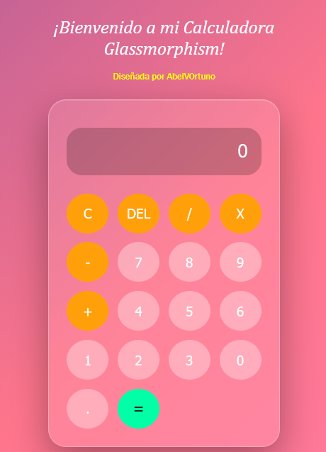
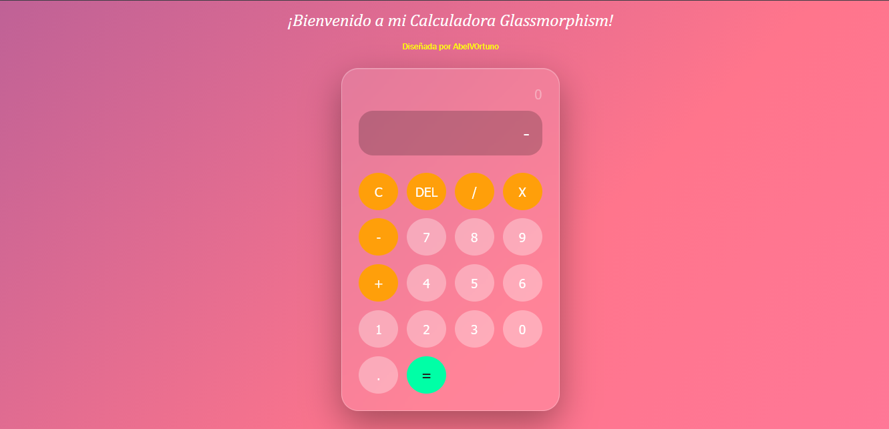

# Calculadora Glassmorphism
Una calculadora moderna desarrollada con **HTML,CSS y JAVASCRIPT**,con un diseño visual basado en el estilo **glassmorphism** e inspirado en las interfaces modernas de apps moviles.

Este proyecto fue creado como parte de mi **portafolio de desarrollador web frontend**, con el objetivo de practicar manipulacion del DOM,logica con JS y diseño de interfaces modernas con CSS.

---
## Caracteristicas principales ##

- Operaciones aritmeticas basicas (+,-,x, /)
- Animaciones al presionar los botones
- Soporte para uso del teclado ("keyboard")
- Historial de operaciones
- Funcion de borrar y reiniciar automaticas
- Diseño moderno con efecto **glassmorphism**
- Fondo degradado animado y dinamico
- Layout construido con **CSS Grid**

---
## Tecnologias utilizadas ##
- HTML5
- CSS3
- JavaScript (Vainilla JS)

---
## Vista Previa

 **Version Movil**

**Version Desktop**

## Demo en Vivo 
Si deseas probar la calculadora puedes verla aqui: 

[Visita mi sitio](https://glassmorphism-calculator-moderm.netlify.app/)

## Que practique en este proyecto?
- Manipulacion del DOM con JavaScript
- Manejo de eventos
- Uso de funciones en JavaScript
- Creacion de interfaces con **glassmorphism**
- Animaciones y transiciones en CSS

## Autor(es)

Proyecto diseñado y desarrollado por 

**Abel Valverde**

Desarrollador web Frontend